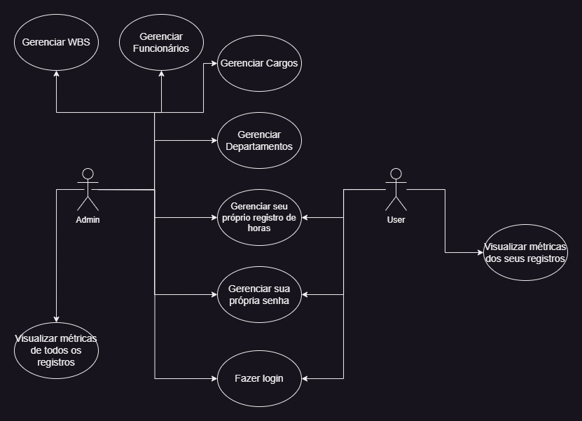
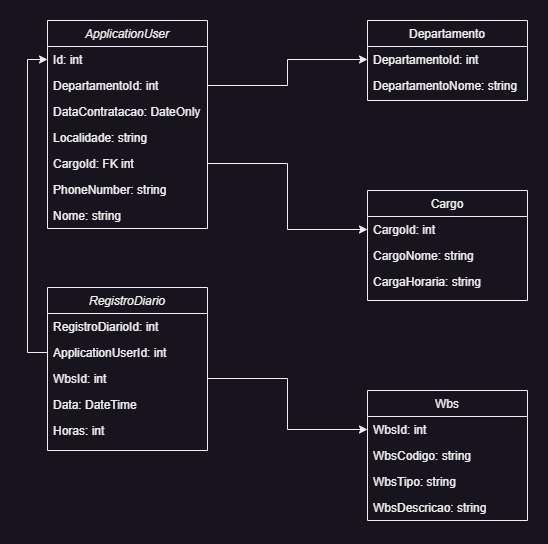



# Orange O'Clock

## Pré-visualização

<video controls>
    <source src="./ProjetoMyTeDev/wwwroot/video/preview.mp4" type="video/mp4">
</video>

## Tecnologias utilizadas

## Descrição

O Orange O'Clock é um programa desenvolvido para registrar as horas trabalhadas pelos funcionários em atividades específicas, conhecidas como Work Breakdown Structure (WBS).

## Diagramas

### Casos de Uso 

### Diagrama de Classes

## Funcionalidades Principais:

### Admin

#### Gerenciamento de Departamentos

- Adicionar, visualizar, atualizar e excluir registros de departamentos.

- Filtrar departamentos por nome ou ID.

- Existem departamentos pré-configurados no banco que podem, também, ser gerenciados.

#### Gerenciamento de Funcionários

- O admin pode adicionar, visualizar, atualizar e excluir as WBS.

#### Gerenciar Wbs

- O admin pode adicionar, visualizar, atualizar e excluir as informações dos funcionários.

- Cada registro de funcionário contém informações como ID, nome, departamento e data de contratação.

- Filtrar WBS por código e descrição.

#### Gerenciamento de Cargos

- O admin pode adicionar, visualizar, atualizar e excluir os cargos.

- Filtrar cargos por nome ou ID.

- Existem departamentos pré-configurados no banco que podem, também, ser gerenciados.

#### Métricas dos funcionários

- O usuário consegue ver um relatório com as métricas dos registros de horas de todos os funcionários.

### User

#### Métricas

- O usuário consegue ver um relatório com suas próprias métricas de registro de horas.

### Funcionalidades comuns (admins e users)

#### Login

- É possível logar com e-mail e senha.

#### Gerenciar seu próprio registro de horas

- É possível adicionar, visualizar e editar o registro de horas.

#### Gerenciar sua própria senha

- É possível alterar a senha inserindo a antiga e confirmando a nova.

