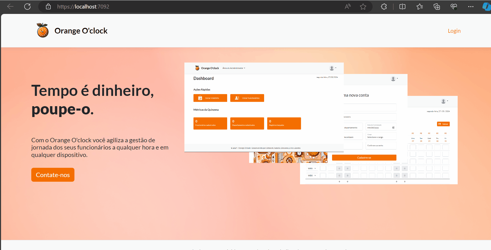
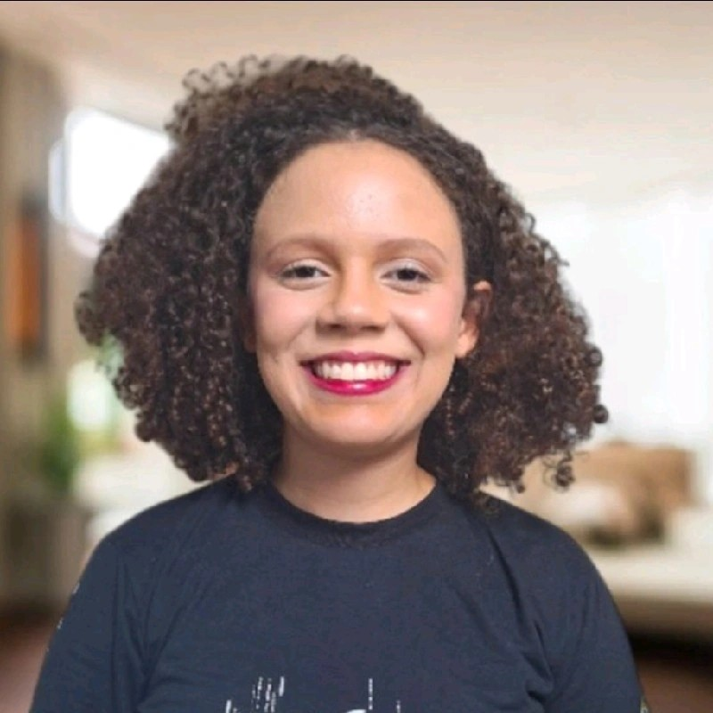



# Orange O'Clock

## Pré-visualização



## Tecnologias utilizadas


## Descrição

O Orange O'Clock é um programa desenvolvido para registrar as horas trabalhadas pelos funcionários em atividades específicas, conhecidas como Work Breakdown Structure (WBS).

## Diagramas

### Casos de Uso


### Diagrama de Classes


## Funcionalidades Principais:

### Admin

#### Gerenciamento de Departamentos

- Adicionar, visualizar, atualizar e excluir registros de departamentos.

- Filtrar departamentos por nome ou ID.

- Existem departamentos pré-configurados no banco que podem, também, ser gerenciados.

#### Gerenciamento de Funcionários

- O admin pode adicionar, visualizar, atualizar e excluir as WBS.

#### Gerenciar Wbs

- O admin pode adicionar, visualizar, atualizar e excluir as informações dos funcionários.

- Cada registro de funcionário contém informações como ID, nome, departamento e data de contratação.

- Filtrar WBS por código e descrição.

#### Gerenciamento de Cargos

- O admin pode adicionar, visualizar, atualizar e excluir os cargos.

- Filtrar cargos por nome ou ID.

- Existem departamentos pré-configurados no banco que podem, também, ser gerenciados.

#### Métricas dos funcionários

- O usuário consegue ver um relatório com as métricas dos registros de horas de todos os funcionários.

### User

#### Métricas

- O usuário consegue ver um relatório com suas próprias métricas de registro de horas.

### Funcionalidades comuns (admins e users)

#### Login

- É possível logar com e-mail e senha.

#### Gerenciar seu próprio registro de horas

- É possível adicionar, visualizar e editar o registro de horas.

#### Gerenciar sua própria senha

- É possível alterar a senha inserindo a antiga e confirmando a nova.

## Pré-requisitos

- Visual Studio
- Microsoft SQL Server
- .NET

## Como testar?

- No Package Manager Console do Visual Studio, use o comando abaixo para criar o banco de dados local:

    ``` bash
    update-database
    ```

- Execute a aplicação e logue com o usuário padrão:

    - **E-mail**: `admin@avanade.com`
    - **Senha**: `Admin2024@` 

## Critérios e Regras

- Validação das credenciais de login.
- Validação do preenchimento de horas.
- Restrições de caracteres para códigos de WBS.
- Exigência de pelo menos 8 horas preenchidas por dia útil.
- Navegação de quinzenas não anterior a 01/01/2024.

## Conheça e contate nossa equipe

<code>
<div style="display: flex; justify-content: space-between;">
<div style="text-align: center;">


### Déborah Brodowski

_Assoc, Full-Stack Developer at Avanade_

[](https://www.linkedin.com/in/deborahpazb)
[](https://github.com/deborahpaz)

</div>
<div style="text-align: center;">


### Isabella Coutinho

_Assoc, Full-Stack Developer at Avanade_

[](https://www.linkedin.com/in/isaaregina)
[](https://github.com/isaaregina)
</div>
</div>

<div style="display: flex; justify-content: space-between;">
<div style="text-align: center;">


### Giovanna Camelo

_Assoc, Full-Stack Developer at Avanade_

[](https://www.linkedin.com/in/giovanna-camelo-0220992a2)
[](https://github.com/Giovanna-Camelo)
</div>

<div style="text-align: center;">


### Lívia Nascimento


_Assoc, Full-Stack Developer at Avanade_

[](https://www.linkedin.com/in/liviarnascimento)
[](https://github.com/livnascimento)
</div>
</div>

<div style="text-align: center;">


### Zandra Vieitez

_Assoc, Full-Stack Developer at Avanade_

[](https://www.linkedin.com/in/zandravieitez)
[](https://github.com/Zvieitez)

</div>
</code>

## Contribuições

O nosso projeto é vivo e ainda temos muito a implementar, então ideias são muito bem-vindas! Caso identifique qualquer erro ou oportunidade de melhoria, pedimos que [nos contate](#conheça-e-contate-nossa-equipe) para bater um papo sobre! 

## Agradecimentos

Agradecemos à Avanade por nos disponibilizar o treinamento com a Impacta para que pudéssemos desenvolver um projeto tão completo, além de nos preparar muito mais para os desafios que virão. 

Também agradecemos ao nosso professor [Juan Pablo](https://www.linkedin.com/in/juan-pablo-santos-22889963) que nos acompanhou durante os últimos dois meses.

---

Apreciamos muito sua visita ao nosso projeto! 🧡

